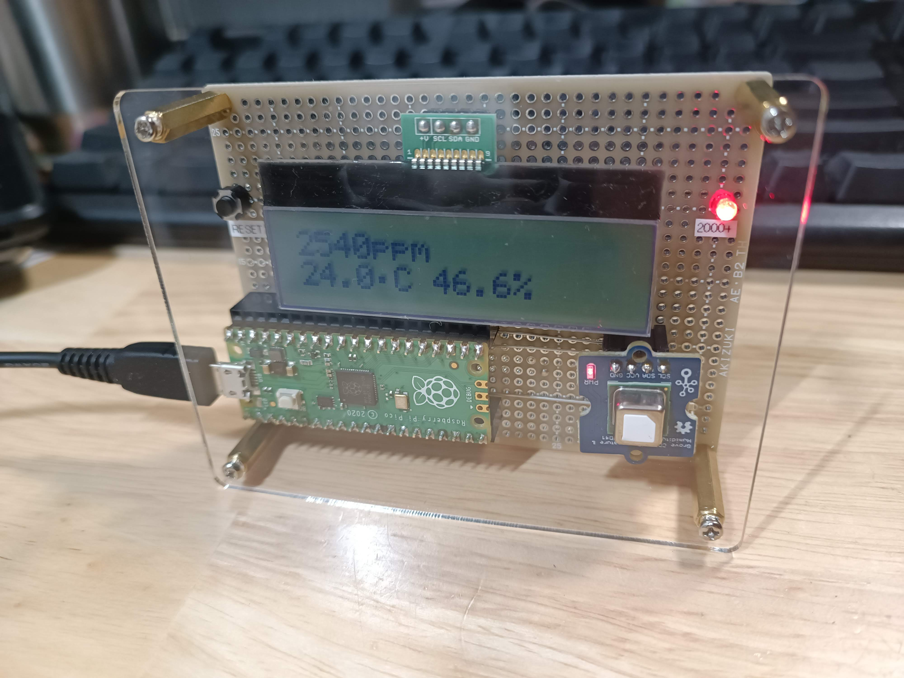
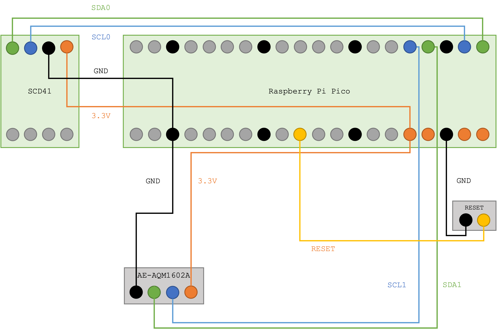

# rpi-pico-scd4x

A demo program for the Sensirion SCD4X (SDC40, SCD41) CO2/temperature/humidity sensor that works on RP2040 microcontroller written in MicroPython.

The ESP32 version is also available at [morrisseyj/esp32-scd4x](https://github.com/morrisseyj/esp32-scd4x) (Thanks [@morrisseyj](https://github.com/morrisseyj)).

## Components

- RP2040
  - Example module: [Raspberry Pi Pico](https://www.raspberrypi.com/products/raspberry-pi-pico/)
- SCD41
  - Example module: [SEEED-101020952](https://www.seeedstudio.com/Grove-CO2-Temperature-Humidity-Sensor-SCD41-p-5025.html)
  - Based program: [adafruit/Adafruit_CircuitPython_SCD4X](https://github.com/adafruit/Adafruit_CircuitPython_SCD4X) (MIT License)
- AQM1602A
  - Example module: [AE-AQM1602A(KIT)](https://akizukidenshi.com/catalog/g/gK-08896/)

## License

[MIT license](LICENSE)

## Author

[mikan](https://github.com/mikman)
